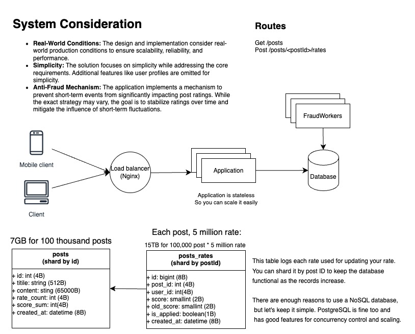

# Interview code challenge (Python): Post rating - BitPin 2024

## Index
- [Introduction](#introduction)
- [Design and Architecture](#design-and-architecture)
- [Quick Setup](#quick-setup)
- [Run Tests](#run-tests)
- [Considerations](#considerations)

## Introduction
This Django application is designed and implemented using Django Rest Framework (DRF) to allow users to view a list of posts and rate them. Each post consists of a title and content.

### Features
1. **Display List of Posts:**
In the list view of posts, users can see the title of each post along with the number of users who have rated the post and the average rating. The implementation is optimized to handle a large number of ratings, ensuring performance even with millions of ratings per post. If a user has rated a post, their rating is displayed as well.

2. **Rate a Post:**
Users can rate a post by providing a score between 0 and 5. If a user rates a post multiple times, their previous rating will be updated. There's no need for a feature to delete ratings. To address the issue of short-term events influencing post ratings, a mechanism is implemented to mitigate the impact of short-term fluctuations in ratings. While there's no specific solution to this problem, the application implements a strategy to stabilize post ratings over time.

### Considerations
* **Real-World Conditions:** The design and implementation consider real-world production conditions to ensure scalability, reliability, and performance.
* **Simplicity:** The solution focuses on simplicity while addressing the core requirements. Additional features like user profiles are omitted for simplicity.
* **Anti-Fraud Mechanism:** The application implements a mechanism to prevent short-term events from significantly impacting post ratings. While the exact strategy may vary, the goal is to stabilize ratings over time and mitigate the influence of short-term fluctuations.

### Conclusion
This application provides a robust solution for users to rate and view posts while considering the challenges of managing ratings in a real-world production environment. The implemented features ensure usability, performance, and reliability while addressing the unique challenges posed by short-term rating fluctuations.

## Design and Architecture


### Anti-Fraud System
To prevent sudden and abnormal rating behavior (e.g., mass low ratings due to a social media campaign), several approaches can be considered:

1. **Delaying Rate Effects**:
This approach delays the impact of ratings on the post's average rating. During the delay, batch processing can be performed to analyze and reduce the effect of suspicious ratings.

    **Pros:**
    * Provides time to detect and analyze suspicious rating patterns.
    * Reduces the immediate impact of fraudulent activities on the post's rating.
    * Batch processing can include complex analytics to detect and mitigate fake ratings.

    **Cons:**
    * Introduces a delay in reflecting legitimate user ratings.
    * Requires additional storage and processing for delayed ratings.
    * Complexity in implementation and maintaining batch processing logic.


2. **Logging and Anomaly Detection:**
This method involves logging all rating activities and using an anomaly detection algorithm to identify and mitigate the effect of fake ratings.

    **Pros:**
    * Real-time updates to ratings without delay.
    * Can use sophisticated algorithms to accurately detect fraudulent activities.
    * No need for additional storage for delayed ratings.

    **Cons:**
    * Requires development and tuning of anomaly detection algorithms.
    * May not be as effective in preventing the initial impact of sudden fraudulent activities.
    * Higher computational overhead for real-time anomaly detection.

#### Implementation Details
In this project, I have implemented the delayed effect on post average rating to mitigate the impact of sudden fraudulent rating activities. For simplicity, I have skipped the extra logic for detecting fake ratings during the batch processing.

## Quick Setup
Follow these steps to set up and run the application locally. Ensure Docker is installed and running on your system before executing these commands.

```bash
# Clone the project from GitHub
git clone https://github.com/aminkt/interview-python-post-rating

# Navigate to the project directory
cd interview-python-post-rating

# Rename the sample environment file and edit the required values
mv .env.sample .env
# Edit the .env file with your preferred text editor to set the required values

# Start the Docker containers
docker-compose up -d

# Run database migration if required
docker-compose exec app manage.py migrate

# Create a superuser to access the admin interface
docker-compose exec app manage.py createsuperuser
# Follow the prompts to create a superuser account
```
Open [http://localhost:8000/swagger/](http://localhost:8000/swagger/) in your web browser to view the API documentation.

## Run Tests
To run test run below command:
```bash
docker-compose exec app python3 manage.py test --verbosity=2
```